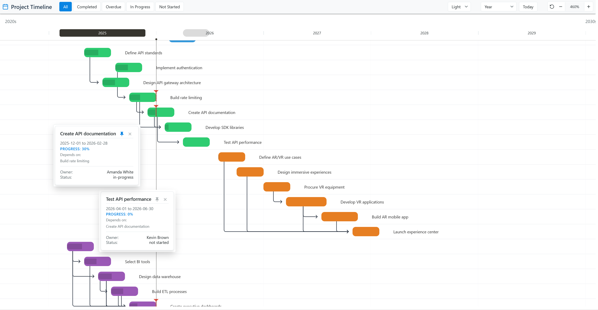
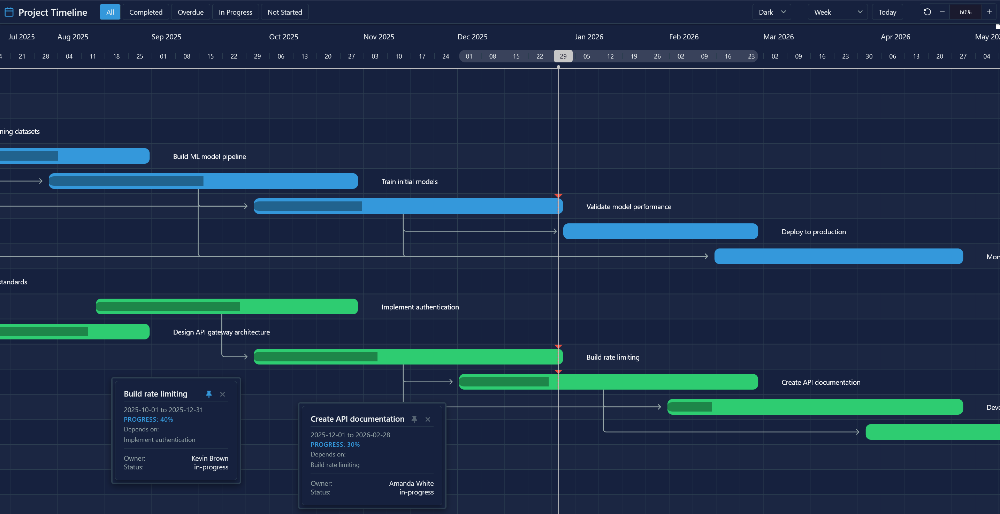

# Gantt Chart Plugin for Dataiku

Visualize your project timelines, dependencies, and progress with an interactive Gantt chart. This plugin integrates the [Frappe Gantt](https://github.com/frappe/gantt) library directly into Dataiku DSS webapps.

## Features

- **Interactive Visualization**: Zoom, scroll, and navigate your timeline with intuitive controls
- **Multiple Views**: Switch between Hour, Quarter Day, Half Day, Day, Week, Month, and Year views
- **Task Dependencies**: Visualize dependencies with automatic arrow rendering
- **Progress Tracking**: Display task completion with progress bars and completion checkmarks
- **Expected Progress Markers**: Visual indicators showing where progress should be based on current date
- **Task Filtering**: Filter tasks by status (All, Completed, Overdue, In Progress, Not Started)
- **Hierarchical Grouping**: Group tasks by category columns (e.g., Team, Region, Phase)
- **Color Coding**: Color-code tasks by category with 5 built-in palettes or custom admin-defined presets
- **Custom Tooltips**: Select specific columns to display in task details popup
- **Pinnable Tooltips**: Pin multiple tooltips to compare tasks side-by-side
- **Theme Support**: Light, Dark, and Auto themes with consistent styling
- **Language Localization**: Date/month formatting in 11 languages
- **Configurable Grid**: Show/hide grid lines with adjustable opacity
- **Date Format Options**: ISO, US, European, Long, and Short date formats for tooltips
- **Sticky Header**: Header stays visible while scrolling through large timelines
- **Duplicate ID Handling**: Auto-rename or skip duplicate task IDs with visual indicators
- **Getting Started Guide**: Interactive onboarding for new users
- **Offline Capable**: Bundled dependencies ensure functionality in air-gapped environments

## Configuration

The plugin provides a standard webapp with the following configuration options:

### Required Columns
- **Task ID**: Unique identifier for each task
- **Start Date**: Date column indicating when the task begins
- **End Date**: Date column indicating when the task finishes

### Optional Columns
- **Task Name**: Display label for the task (defaults to Task ID if unspecified)
- **Progress**: Numerical column (0-100) representing completion percentage
- **Dependencies**: Column containing comma-separated IDs of prerequisite tasks
- **Color By**: Categorical column to assign colors
- **Tooltip Fields**: Additional columns to display in the task details popup

### View Settings
- **Default View**: Initial time scale (Hour, Quarter Day, Half Day, Day, Week, Month, Year)
- **Sort By**: Order tasks by date, name, duration, or dependencies
- **Group By**: Hierarchical grouping by one or more categorical columns

### Appearance Settings
- **Theme**: Light, Dark, or Auto (follows system preference)
- **Color Palette**: Default, Pastel, Earth, Ocean, Sunset, or Custom (admin preset)
- **Language**: Date/month localization (English, Spanish, German, French, and 7 more)
- **Grid Lines**: Show/hide horizontal and vertical grid lines
- **Grid Opacity**: Adjust grid line visibility (0-100%)
- **Date Format**: Tooltip date format (ISO, US, European, Long, Short)

### Data Handling
- **Duplicate ID Handling**: Auto-rename duplicates or skip them
- **Max Tasks**: Limit rows for performance (default: 1000)

## Usage

1. **Prepare your dataset**: Ensure you have columns for Task ID, Start Date, and End Date
2. **Create a webapp**: Select "Gantt Chart" from the plugin list
3. **Configure columns**: Map your dataset columns to the chart parameters
4. **Run**: The chart will render automatically with the Getting Started guide if needed

## Changelog

See [CHANGELOG.md](CHANGELOG.md) for version history.

## License

This plugin is distributed under the Apache License 2.0.
The bundled Frappe Gantt library is MIT licensed.
